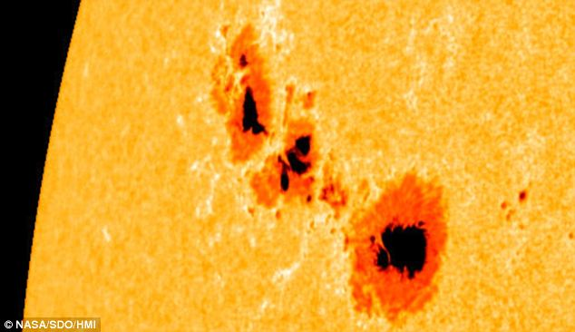

# Portfolio

## [Pronosticando el número de manchas solares](https://github.com/HYP03/Sun_spots)
Este repositorio incluye el ajuste de un modelo ARMA para pronosticar el núméro de manchas solares. 

## [Deteccion temprana del Alzheimer](https://github.com/HYP03/Deteccion_Alzheimer)
Este repositorio incluye la comparacion de diferentes metodos de clasificacion para la deteccion temprana del Alzheimer. 

---

© 2020 Khanh Tran. Powered by Jekyll and the Minimal Theme.

